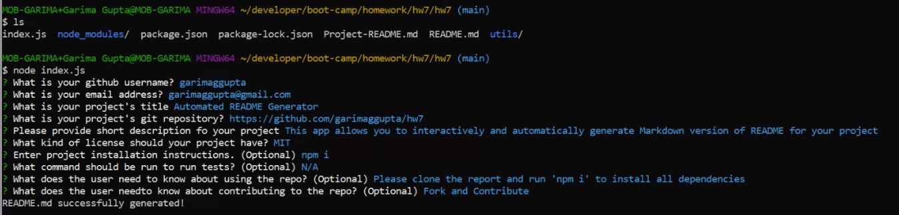
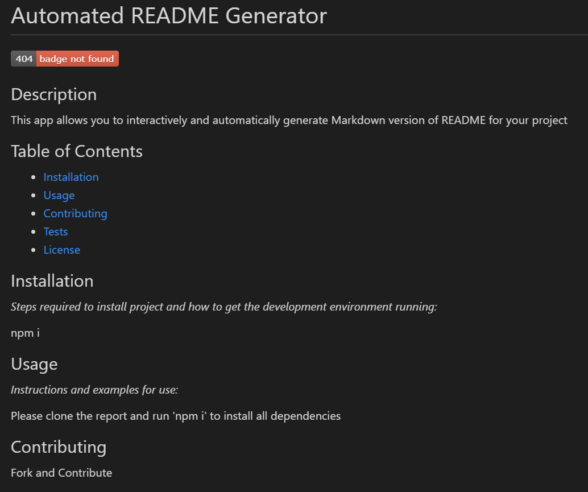

# README Generator

## Table of Contents

* [About the Project](#about-the-project)
* [Technology](#Technology)
* [Installation](#installation)
* [Database_Schema](#database-schema)
* [Roadmap](#roadmap)
* [Contributing](#contributing)
* [Contact](#contact)
* [LinkedIn](#LinkedIn)

## About the Project:
The app is command-line application dynamically generates a professional README.md file from a user's input.

### Technology:
This app is build with [Node.js](https://nodejs.org/en/) and [Inquirer package](https://www.npmjs.com/package/inquirer) .

### Installation:
Clone the Repository and run 'npm i' to install all dependencies.

## Roadmap:
Currently no known issues, but track [open issues](https://github.com/garimaggupta/hw7/issues) for proposed features (and known issues) in the future.  
  
## Contributing:

1. Fork the Project
2. Create your Feature Branch (`git checkout -b feature/AmazingFeature`)
3. Commit your Changes (`git commit -m 'Add some AmazingFeature'`)
4. Push to the Branch (`git push origin feature/AmazingFeature`)
5. Open a Pull Request

## Contact:
garimaggupta@gmail.com

## LinkedIn:
[https://www.linkedin.com/in/garima-gupta-b3464b2/](https://www.linkedin.com/in/garima-gupta-b3464b2/)
